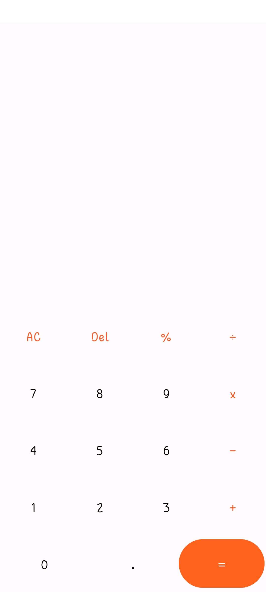
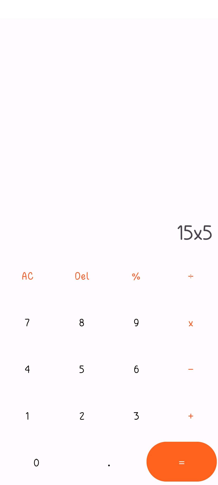
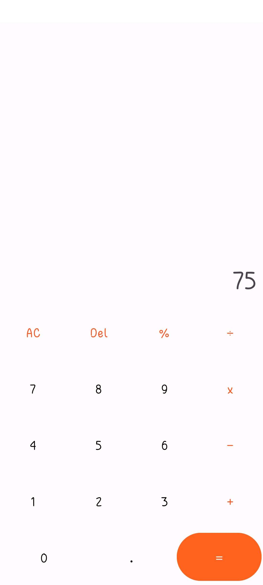

# Calculator

Introducing "CalcEasy": Your All-in-One Calculator App

Are you tired of carrying around a bulky calculator or searching for one on your phone every time you need to perform basic or complex mathematical operations? Look no further! "CalcEasy" is here to simplify your life and make mathematical calculations a breeze.

"CalcEasy" is a user-friendly and feature-packed calculator app built with Kotlin and powered by Android Studio. It offers all the essential functionalities you'd expect from a calculator and more. Whether you're a student solving equations, a professional working on financial calculations, or simply need a handy tool for everyday math, "CalcEasy" has got you covered.

Key Features:

**Basic Arithmetic Operations:** Perform addition, subtraction, multiplication, and division with ease.

**No Ads:**  Enjoy a distraction-free calculation experience.

With "CalcEasy" in your pocket, you'll never have to worry about math problems again. It's the ideal companion for students, professionals, and anyone in need of a reliable calculator at their fingertips.

# Screen Shots

